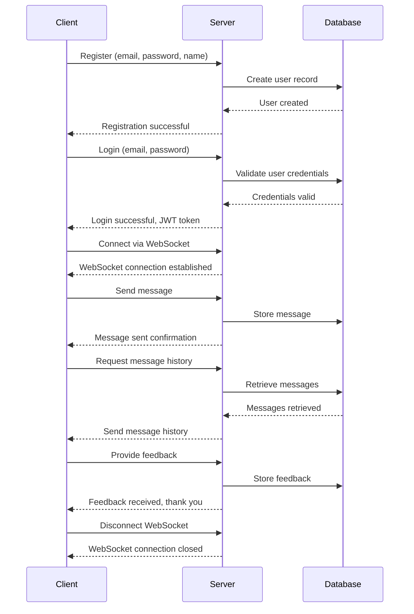

# Chatbot Project

## Introduction

This project is a comprehensive chatbot application designed to facilitate real-time communication between users and a server. It supports user registration, authentication, message exchange, and feedback collection. The application is built using Go and leverages WebSocket for real-time messaging and HTTP for standard API interactions.

## Architecture Overview

The project follows a client-server architecture with the following components:

### Client
- **Command-Line Interface (CLI)**: A user-friendly interface for interacting with the chat server, allowing users to register, log in, send messages, and provide feedback.
- **WebSocket Client**: Manages real-time communication with the server, ensuring low-latency message exchange.
- **HTTP Client**: Handles RESTful API requests for operations like login, registration, and message history retrieval.

### Server
- **Authentication Service**: Manages user authentication, including login, token refresh, and authorization middleware.
- **WebSocket Server**: Handles real-time communication, managing connections, and message broadcasting.
- **Sentiment Analysis Service**: Provides sentiment analysis capabilities, possibly using a mock or real API.
- **Routing and Middleware**: Manages API endpoints and applies middleware for tasks like authentication and logging.

### Database
- **Postgres**: Stores user data, messages, and possibly configuration settings.
- **Session Management**: Tracks active WebSocket sessions and user activity.

## Communication Flow Diagram



## Features
- **User Authentication**: Secure login and registration using JWT.
- **Real-Time Messaging**: Low-latency communication using WebSocket.
- **Feedback Collection**: Allows users to rate the service and provide comments.
- **Sentiment Analysis**: Analyzes user feedback to determine sentiment.

## Getting Started

### Prerequisites
- Go 1.16 or later
- A running instance of a PostgreSQL

### Installation
1. Clone the repository:
   ```bash
   git clone https://github.com/JennerWork/chatbot.git
   ```
2. Navigate to the project directory:
   ```bash
   cd chatbot
   ```
3. Build the client and server:
   ```bash
   go build -o chatclient cmd/client/main.go
   go build -o chatserver cmd/server/main.go
   ```

### Running the Application
- **Server**: Start the server by running:
  ```bash
  ./chatserver
  ```
- **Client**: Start the client by running:
  ```bash
  ./chatclient -email="user@example.com" -password="yourpassword"
  ```
- **Register a New User**: To register a new user, run:
  ```bash
  ./chatclient -register -email="newuser@example.com" -password="newpassword" -name="New User"
  ```

## Contributing
Contributions are welcome! Please fork the repository and submit a pull request for any improvements or bug fixes.

## License
This project is licensed under the MIT License - see the LICENSE file for details.